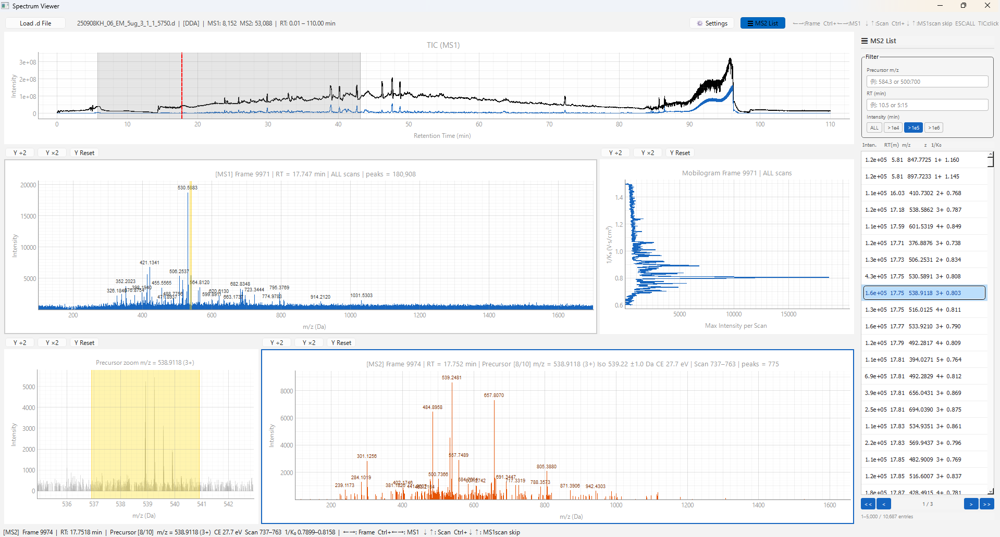

# timsTOF Spectrum Viewer

An interactive spectrum viewer for Bruker timsTOF data (`.d` folders), built with PyQt6 and pyqtgraph.

 

---

## Screenshots

**Screenshot**


---

## Download (Windows)

👉 [Download v1.1.0 (zip)](https://www.dropbox.com/scl/fi/4a0ukhptxm16fov1zgqr0/timstof_spectrum_viewer_v1.1.0.zip?rlkey=xho7d26dhcnxfq5174rru80j2&st=pj6p8f9b&dl=1)

Unzip and run `timstof_spectrum_viewer.exe`. No installation required.

> ⚠️ **Important:** Extract the zip to a path with **no Japanese or special characters**.  
> Recommended: `C:\timstof-viewer\`

> **Note:** Windows only. Python environment is not required for the exe version.

---

## Features

- **TIC / BPI chromatogram** — Click to jump to the nearest MS1 frame
- **MS1 spectrum**
  - ALL mode: sum of all scans
  - Scan mode: single scan with grey background reference
  - Block scan mode: 100-scan window displayed as-is (no summation)
- **MS2 spectrum** — DDA and DIA auto-detection
  - Integrated mode: scan-averaged spectrum per precursor
  - Raw scan mode: individual scan with grey background reference
- **Mobilogram** — per-scan max intensity, clickable for scan navigation
- **Precursor zoom panel** — isolation window highlighted in MS1 spectrum
- **Keyboard navigation** — frame and scan traversal without touching the mouse
- **Peak labels** — zoom-linked automatic annotation
- **Yellow band accumulation** — overlay multiple precursor isolation windows
- **MS2 List panel** *(DDA only)* — Browse and search all precursors in the dataset
  - Displays intensity, RT, m/z, charge, and ion mobility (1/K₀) for each precursor
  - Filter by m/z (single value ±20 ppm or range, e.g. `500:700`), RT (±10 min or range), and intensity threshold (`>1e4` / `>1e5` / `>1e6`)
  - Page navigation (5,000 entries/page) with current page range highlighted on TIC
  - Click or press Enter to jump to the selected spectrum (MS1, MS2, TIC cursor all update simultaneously)
  - Keyboard ↓↑ for list navigation; lookahead scrolling keeps surrounding entries visible

---

## Requirements

```
Python 3.11
PyQt6
pyqtgraph
opentimspy
numpy
```

> **Note:** Python 3.11 is required. opentimspy is not compatible with Python 3.12 or later.

Install dependencies:

```bash
pip install pyqt6 pyqtgraph opentimspy numpy
```

---

## Usage

```bash
python timstof_spectrum_viewer.py
```

Click **"Load .d File"** and select a Bruker timsTOF `.d` directory. Both DDA and DIA datasets are supported and detected automatically.

---

## Keyboard Shortcuts

| Key | Action |
|-----|--------|
| `→` / `←` | Next / previous frame |
| `Ctrl+→` / `Ctrl+←` | Next / previous MS1 frame |
| `↓` / `↑` | Next / previous scan or precursor |
| `Ctrl+↓` / `Ctrl+↑` | Skip MS1 scans (jump between MS1 ALL and MS2) |
| `ESC` | Return to MS1 ALL mode |

*When the MS2 List panel is focused, `↓` / `↑` navigate the list and `Enter` jumps to the selected spectrum.*

---

## Settings Panel

| Option | Description |
|--------|-------------|
| Block scan mode (100 scans) | MS1: display 100 scans as a block, navigated in block units |
| Grey background in Scan mode | Show ALL spectrum as grey reference behind current scan |
| Keep X scale on frame change | Preserve m/z range when moving between frames |
| Raw scan mode | MS2: show individual scans with integrated spectrum as grey reference |
| Accumulate precursor bands | Keep yellow isolation window overlays across precursors |

---

## MS2 List Panel

Available for DDA datasets only. Click the **☰ MS2 List** button in the toolbar to open.

- The precursor index is built on first open (one-time cost per file)
- **Filter syntax**

| Input | Behavior |
|-------|----------|
| `584.3` | m/z: center ±20 ppm / RT: center ±10 min |
| `500:700` | m/z or RT: range (min to max) |
| Intensity radio | `ALL` / `>1e4` / `>1e5` / `>1e6` |

- Press **Enter** in either filter field to apply
- Use `<<` / `<` / `>` / `>>` buttons to navigate pages (10-page / 1-page jump)
- The grey band on the TIC shows the RT range of the current page

---

## Data Compatibility

Tested on:

- Bruker timsTOF Pro (DDA, diaPASEF)

Requires [opentimspy](https://github.com/MatteoLacki/opentimspy) for raw data access.

---

## Development

This project was developed by a timsTOF operator (non-engineer) with the assistance of AI.

| Version | Changes | AI Model |
|---------|---------|----------|
| v1.0.0 | Initial release | Claude Sonnet 4.6 (Anthropic) |
| v1.1.0 | MS2 List panel, intensity filter, page navigation, TIC range highlight | Claude Sonnet 4.6 (Anthropic) |

Code quality and functionality are best evaluated by actually running the tool.

---

## License

This software is released under the [GNU General Public License v3.0](LICENSE).
