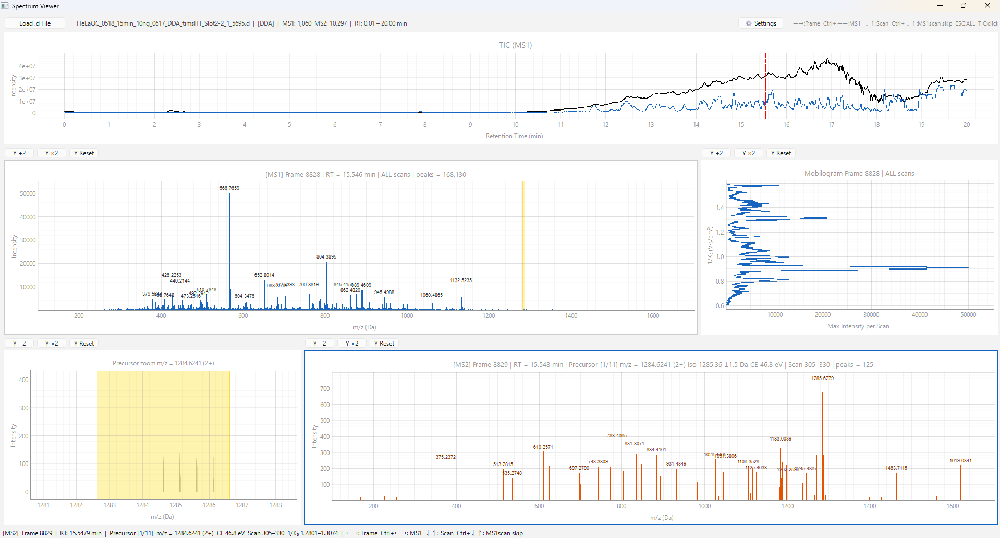

# timsTOF Spectrum Viewer

An interactive spectrum viewer for Bruker timsTOF data (`.d` folders), built with PyQt6 and pyqtgraph.

 




---

## Features

- **TIC / BPI chromatogram** — Click to jump to the nearest MS1 frame
- **MS1 spectrum**
  - ALL mode: sum of all scans
  - Scan mode: single scan with grey background reference
  - Block scan mode: 100-scan window displayed as-is (no summation)
- **MS2 spectrum** — DDA and DIA auto-detection
  - Integrated mode: scan-averaged spectrum per precursor
  - Raw scan mode: individual scan with grey background reference
- **Mobilogram** — per-scan max intensity, clickable for scan navigation
- **Precursor zoom panel** — isolation window highlighted in MS1 spectrum
- **Keyboard navigation** — frame and scan traversal without touching the mouse
- **Peak labels** — zoom-linked automatic annotation
- **Yellow band accumulation** — overlay multiple precursor isolation windows

---

## Requirements

```
Python 3.11
PyQt6
pyqtgraph
opentimspy
numpy
```

> **Note:** Python 3.11 is required. opentimspy is not compatible with Python 3.12 or later.

Install dependencies:

```bash
pip install pyqt6 pyqtgraph opentimspy numpy
```

---

## Usage

```bash
python timstof_spectrum_viewer.py
```

Click **"Load .d File"** and select a Bruker timsTOF `.d` directory. Both DDA and DIA datasets are supported and detected automatically.

---

## Keyboard Shortcuts

| Key | Action |
|-----|--------|
| `→` / `←` | Next / previous frame |
| `Ctrl+→` / `Ctrl+←` | Next / previous MS1 frame |
| `↓` / `↑` | Next / previous scan or precursor |
| `Ctrl+↓` / `Ctrl+↑` | Skip MS1 scans (jump between MS1 ALL and MS2) |
| `ESC` | Return to MS1 ALL mode |

---

## Settings Panel

| Option | Description |
|--------|-------------|
| Block scan mode (100 scans) | MS1: display 100 scans as a block, navigated in block units |
| Grey background in Scan mode | Show ALL spectrum as grey reference behind current scan |
| Keep X scale on frame change | Preserve m/z range when moving between frames |
| Raw scan mode | MS2: show individual scans with integrated spectrum as grey reference |
| Accumulate precursor bands | Keep yellow isolation window overlays across precursors |

---

## Data Compatibility

Tested on:

- Bruker timsTOF HT (PASEF, diaPASEF data)

Requires [opentimspy](https://github.com/MatteoLacki/opentimspy) for raw data access.

---

## License

This software is released under the [GNU General Public License v3.0](LICENSE).
